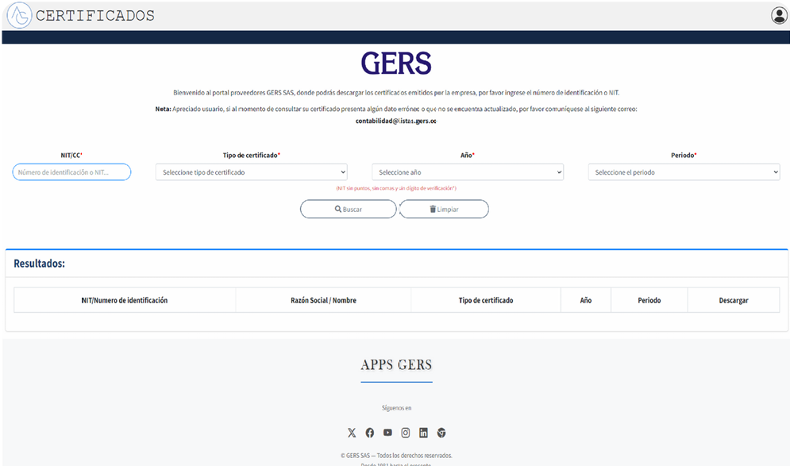

# 📄 Sistema de Gestión de Certificados

Sistema web desarrollado en **PHP, JavaScript y MySQL** para la gestión y generación de certificados, permitiendo administrar la información de los usuarios y generar certificados de manera organizada y eficiente.

---

## 🚀 Tecnologías utilizadas

- PHP
- JavaScript
- HTML5
- CSS3
- Bootstrap
- MySQL
- XAMPP

---

## ✨ Funcionalidades

- 🔐 Inicio de sesión de usuarios.
- 👥 Gestión de información de usuarios.
- 📄 Generación de certificados.
- 🔎 Consulta de registros.
- 💾 Almacenamiento de información en MySQL.
- 🖥️ Interfaz web intuitiva y fácil de usar.

---

## 📸 Capturas del sistema

### Inicio



### Filtro


### Pie de Pagina


---

## ⚙️ Instalación

1. Clonar el repositorio.

```bash
git clone https://github.com/TU-USUARIO/sistema-certificados.git
```

2. Copiar el proyecto dentro de la carpeta `htdocs` de XAMPP.

3. Crear una base de datos en MySQL.

4. Importar el archivo `.sql` incluido en el proyecto.

5. Configurar la conexión a la base de datos.

6. Iniciar Apache y MySQL desde XAMPP.

7. Abrir el navegador e ingresar a:

```
http://localhost/sistema-certificados
```

---

## 📂 Estructura del proyecto

```
controllers/
models/
views/
css/
js/
img/
screenshots/
```

---

## 👨‍💻 Autor

**Steven Arenas**

Tecnólogo en Análisis y Desarrollo de Software.

- GitHub: https://github.com/steveenarenas
- LinkedIn: https://www.linkedin.com/in/steven-arenas-658063233/

---

## 📌 Nota

Este proyecto fue desarrollado con fines académicos y de aprendizaje para fortalecer habilidades en el desarrollo de aplicaciones web utilizando PHP, JavaScript y MySQL.
